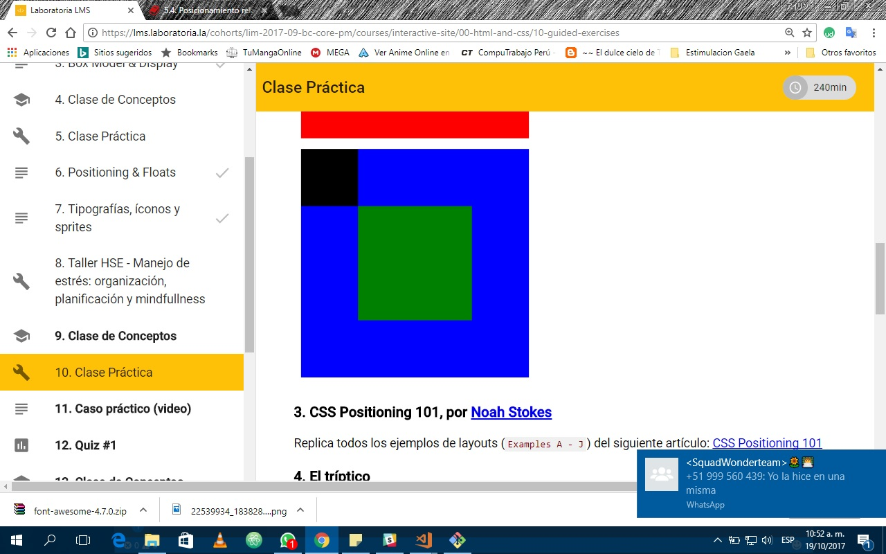

# Posicionamiento en CSS
Este proyecto fue realizado para reforzar los conocimientos en el uso de *Positioning* en el CSS.
## Objetivo del Primer ejercicio:
+ Replicar la imagen utilizando la propiedad **"position"**.

### Herramientas Utilizadas:
+ HTML
+ CSS

#### Imagen de referencia: 

